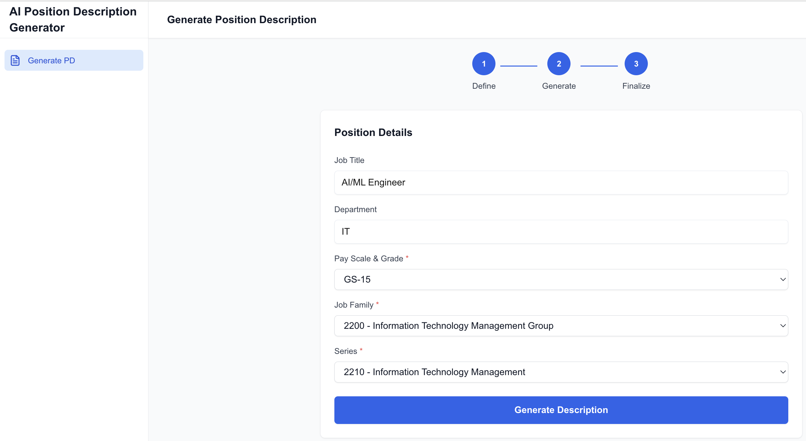

# HR Position Description Generator

[](https://opensource.org/licenses/Apache-2.0)
[](https://nextjs.org/)
[](https://www.typescriptlang.org/)

An AI-powered tool to generate professional federal government job descriptions using **AWS Bedrock** with **Claude 3.5 Sonnet**. Built with **Next.js 16**, **TypeScript**, and deployable on AWS EC2, Vercel, or other Node.js hosted environment.

A live demo is available at https://nextjs-hrpdgenerator.vercel.app. 

## 📸 Screenshots

### Job Description Form


### Generated Results


## 📋 Table of Contents

- [Screenshots](#-screenshots)
- [Features](#-features)
- [Architecture](#-architecture)
- [Getting Started](#-getting-started)
- [Security](#-security-features)
- [Build for Production](#-build-for-production)
- [Deployment](#-deployment-options)
- [Contributing](#-contributing)
- [License](#-license)

## 🎯 Features

- ✅ Generate professional federal government job descriptions using Claude AI via AWS Bedrock
- ✅ OPM (Office of Personnel Management) job family and series data integration
- ✅ Support for multiple pay scales (GS, SES, ES, SL, ST, and others)
- ✅ **Zod validation** for all form inputs (client-side and server-side)
- ✅ Clean separation of concerns: React components call Next.js API routes
- ✅ TypeScript for type safety
- ✅ Secure environment variable handling (no NEXT_PUBLIC_ exposure)
- ✅ Dark mode support with theme toggle
- ✅ Step-by-step UI with progress indicators
- ✅ Copy to clipboard functionality
- ✅ Loading states and error handling
- ✅ Field-level validation with user-friendly error messages
- ✅ Responsive design with Tailwind CSS
- ✅ Ready for EC2 deployment

## 🏗️ Architecture

```
┌─────────────────────┐
│   React Component   │
│   (Client-Side)     │
└──────────┬──────────┘
           │ HTTP Request
           ▼
┌─────────────────────┐
│   Next.js API Route │
│   (Server-Side)     │
└──────────┬──────────┘
           │ AWS SDK
           ▼
┌─────────────────────┐
│    AWS Bedrock      │
│  (Claude 3.5 Sonnet)│
└─────────────────────┘
```

## 📁 Project Structure

```
nextjs-hrpdgenerator/
├── app/
│   ├── api/
│   │   └── generate-description/
│   │       └── route.ts          # API route with Bedrock integration
│   ├── layout.tsx                # Root layout with metadata
│   ├── page.tsx                  # Main page
│   └── globals.css               # Global styles
├── components/
│   ├── HRPositionDescriptionGenerator.tsx  # Main component
│   ├── providers/
│   │   └── theme-provider.tsx    # Theme context provider
│   └── ui/
│       ├── footer.tsx            # Footer component
│       └── theme-toggle.tsx      # Theme toggle component
├── lib/
│   ├── bedrock.ts                # Bedrock client configuration
│   ├── opm-data.ts               # OPM job family and series data
│   └── validation.ts             # Zod validation schemas
├── types/
│   └── index.ts                  # TypeScript interfaces
├── public/                       # Static assets
├── .env.local                    # Environment variables (not committed)
├── .env.example                  # Environment template
└── README.md                     # This file
```

## 🚀 Getting Started

### Prerequisites

- Node.js 18+ installed
- AWS Account with Bedrock access
- AWS credentials with Bedrock permissions
- Claude model access enabled in your AWS region

### 1. Clone and Install

```bash
git clone https://github.com/fmanja/nextjs-hrpdgenerator.git
cd nextjs-hrpdgenerator
npm install
```

### 2. Configure AWS Credentials

Create a `.env.local` file in the root directory:

```bash
cp .env.example .env.local
```

Edit `.env.local` and add your AWS credentials:

```env
AWS_ACCESS_KEY_ID=your_aws_access_key_here
AWS_SECRET_ACCESS_KEY=your_aws_secret_access_key_here
AWS_REGION=us-east-1
BEDROCK_MODEL_ID=anthropic.claude-3-5-sonnet-20241022-v2:0
```

**Security Note:** These variables are **server-side only** and will NOT be exposed to the browser.

### 3. Enable Bedrock Model Access

1. Go to AWS Console → Bedrock → Model access
2. Request access to Claude 3.5 Sonnet
3. Wait for approval (usually instant for Anthropic models)

### 4. Run Development Server

```bash
npm run dev
```

Open [http://localhost:3000](http://localhost:3000) in your browser.

### 5. Test the Application

1. Enter a **Job Title** (e.g., "Senior Software Engineer")
2. Enter a **Department** (e.g., "Engineering")
3. Select a **Pay Scale & Grade** (e.g., "GS-13")
4. Select a **Job Family** (e.g., "0800 - Engineering and Architecture")
5. Select a **Series** (e.g., "0854 - Computer Engineering")
6. Click **Generate Description**
   - Form validation will show field-level errors if any inputs are invalid
   - All fields are validated with Zod before submission
7. Wait for Claude to generate the job description
8. Copy the result to clipboard if needed

## 🔐 Security Features

### ✅ No Client-Side Exposure of Secrets

- **All AWS credentials** are kept server-side in `.env.local`
- **No NEXT_PUBLIC_** prefix used for sensitive variables
- API routes run on the server and never expose credentials
- `.env.local` is in `.gitignore` to prevent accidental commits

### ✅ API Route Protection

The API route validates all inputs using **Zod schemas**:
- **Job Title:** Required, 3-100 characters
- **Department:** Required, 2-100 characters
- **Pay Scale & Grade:** Must be a valid option (GS-1 through GS-15, SES, ES-1 through ES-6, SL, ST, GM, GG, AD)
- **Job Family:** Must be a valid OPM occupational group code
- **Series:** Must be a valid series code for the selected job family
- Proper error handling for AWS errors
- Type-safe request/response with TypeScript
- Federal government position requirements alignment
- Field-level validation errors returned to client

## 📦 Build for Production

```bash
npm run build
npm start
```

### Production Optimizations

The project includes several production-ready optimizations:

- ✅ **Security Headers**: HSTS, X-Frame-Options, X-Content-Type-Options, and more
- ✅ **Compression**: Automatic gzip compression enabled
- ✅ **Standalone Output**: Optimized standalone build for efficient deployments
- ✅ **Image Optimization**: AVIF and WebP format support
- ✅ **Build-Time Safety**: Lazy initialization of AWS Bedrock client prevents build failures
- ✅ **React Strict Mode**: Enabled for better development and production behavior

The build creates a standalone output in `.next/standalone` that can be deployed with minimal dependencies.

## 🔧 Available Scripts

| Command | Description |
|---------|-------------|
| `npm run dev` | Start development server with Turbopack |
| `npm run build` | Build for production |
| `npm start` | Run production server |
| `npm run lint` | Run ESLint |

## 🌐 Deployment Options

### Option 1: AWS EC2 (Recommended)
See [DEPLOYMENT.md](./DEPLOYMENT.md) for detailed EC2 deployment instructions.

### Option 2: Vercel
Vercel deployment requires AWS credentials as environment variables in Vercel settings.

### Option 3: Docker
The project uses standalone output mode, which is optimized for containerized deployments:

```bash
# Build Docker image (requires Dockerfile)
docker build -t hr-generator .
docker run -p 3000:3000 --env-file .env.local hr-generator
```

**Note:** The standalone build in `.next/standalone` contains only the necessary files for production, making Docker images smaller and faster to deploy.

## 🛠️ Tech Stack

- **Framework:** Next.js 16 (App Router)
- **Language:** TypeScript
- **Validation:** Zod (schema validation)
- **AI Provider:** AWS Bedrock (Claude 3.5 Sonnet)
- **Styling:** Tailwind CSS
- **UI Components:** Custom components with dark mode support
- **Data:** OPM (Office of Personnel Management) job classification data
- **Deployment:** AWS EC2 (or Vercel/Docker)
- **Production Features:** Security headers, compression, standalone output mode

## 📊 AWS Bedrock Models

You can use different Claude models by changing `BEDROCK_MODEL_ID`:

| Model ID | Description | Cost |
|----------|-------------|------|
| `anthropic.claude-3-5-sonnet-20241022-v2:0` | Latest & most capable (Recommended) | $$$ |
| `anthropic.claude-3-5-sonnet-20240620-v1:0` | Previous version | $$$ |
| `anthropic.claude-3-sonnet-20240229-v1:0` | Balanced performance | $$ |
| `anthropic.claude-3-haiku-20240307-v1:0` | Fast & economical | $ |

## 🐛 Troubleshooting

### Error: "Access denied to Bedrock"
- Check your AWS credentials in `.env.local`
- Verify IAM permissions include `bedrock:InvokeModel`
- Ensure model access is enabled in Bedrock console

### Error: "Model not found"
- Check `BEDROCK_MODEL_ID` in `.env.local`
- Verify the model is available in your AWS region
- Request model access in Bedrock console

### Build errors
```bash
# Clear Next.js cache
rm -rf .next
npm run build
```

**Note:** The build process uses lazy initialization for AWS Bedrock client, so environment variables are not required during build time. They will be validated at runtime when the API is called.

### Validation errors
- Ensure all form fields are filled correctly
- Job Title must be 3-100 characters
- Department must be 2-100 characters
- Pay Scale & Grade must be selected from the dropdown
- Job Family and Series must be valid OPM codes
- Series must match the selected Job Family

## 📝 Migration from React

This project was migrated from a React app using:
- **OpenAI GPT-3.5** → **AWS Bedrock Claude 3.5**
- **Express.js server** → **Next.js API Routes**
- **JavaScript** → **TypeScript**
- **CRA** → **Next.js 15**
- **Generic job descriptions** → **Federal government position descriptions**
- **Manual job family entry** → **OPM data integration**

## 🤝 Contributing

Contributions are welcome and greatly appreciated! 

Please read our [Contributing Guide](./CONTRIBUTING.md) and [Code of Conduct](./CODE_OF_CONDUCT.md) before contributing.

### Quick Start for Contributors

1. Fork the repository
2. Create a feature branch (`git checkout -b feature/amazing-feature`)
3. Make your changes
4. Test your changes (`npm run build && npm run lint`)
5. Commit your changes (`git commit -m 'Add: amazing feature'`)
6. Push to the branch (`git push origin feature/amazing-feature`)
7. Open a Pull Request

For detailed guidelines, see [CONTRIBUTING.md](./CONTRIBUTING.md).

## 📄 License

This project is licensed under the Apache License, Version 2.0. See the [LICENSE](./LICENSE) file for details.

Copyright 2025 Frank Manja

## 🙏 Acknowledgments
- Cursor for AI agentic code development
- AWS Bedrock for Claude AI access
- Anthropic for Claude 3.5 Sonnet
- Next.js team for the amazing framework

---

**Built with ❤️ using Cursor, React, Next.js, TypeScript, and AWS Bedrock**
